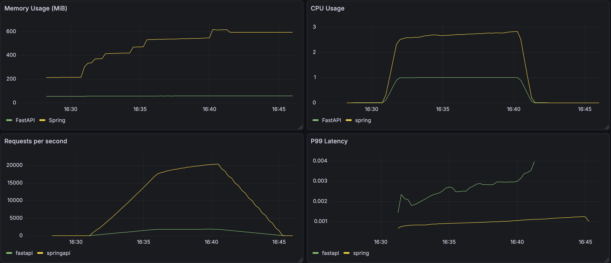
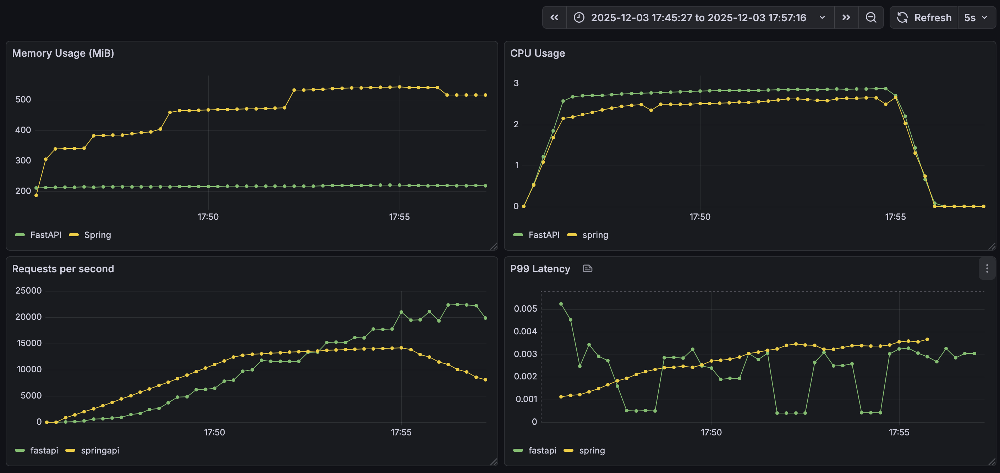
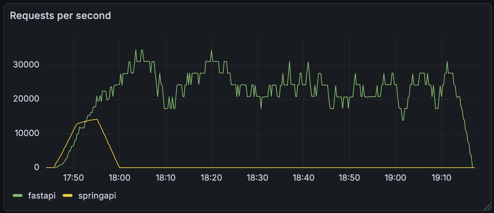
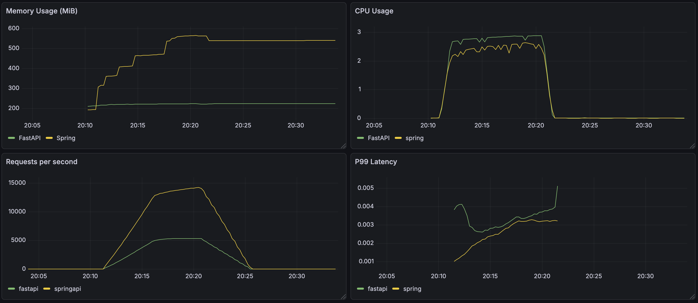

# api-performance-comparison

A comparison of some core metrics for APIs built using different technologies

## How to run/use
`docker-compose up -d --build`
- You can leave out the -d flag if you don't care to run the services in detached mode
- You can leave out the --build flag if you don't need to rebuild the Docker images

With everything running, the given services will be exposed on the following ports:
- Prometheus: **9090**
- Grafana: **3000** (Username: admin  | Password: grafana)
- cadvisor: **8080**
- fastapi-application: **8000**
- java-spring-application: **8001**

The Grafana dashboard has provisioning, so simply navigate to the "FastAPI vs Spring" dashboard if desired.

There are k6 load tests for each service, found in the root directory of this project structure. They apply a virtual user (VU) load, so you will notice that these tests do not necessarily produce an even load in terms of Requests Per Second (RPS) on either service, as one may be faster at servicing a given VU, and move on to the next one.

To run both load tests simultaneously there is a script for your convenience. Make sure that k6 is installed and simply run `bash run-k6-tests.sh`

The load test will run for approximately 10 minutes and scale to 200 Virtual Users.

*Note*: At time of writing, there is a bug on my machine in which container names are not visible by cAdvisor. As such, the CPU and Memory Usage queries must be re-pointed to the appropriate containers by ID after runtime. I will endeavour to solve this at a later time, but am also considering other metrics exporters and/or kubernetes so am leaving it as-is for the short term.

## Comparions/Observations

### Test 1

These are the results from a 10-minute k6 load test on both APIs with the same virtual user (VU) configuration. Some key observations include:
- Firstly, observe the difference in **P99 latency**. The Spring application handled requests MUCH faster (100-300%). Because of this, virtual users are serviced quicker, impacting the amount of requests generated per second (See below)
- Next, observe the difference in **requests per second**. Because of the speed of the Spring application (and other factors that affect the k6 test), the Spring application was given 20,000 requests per second when the load test peaked at 200 virtual users, while the FastAPI application peaked at only 2,000 requests per second. 
    - The Spring application handled around 10x the total requests of the FastAPI one.
- **Memory usage**: The Spring application uses substantially more memory, where it also fluctuates much more greatly. This is likely due to the overhead resulting from the JVM, and also because it was under more load.
- **CPU Usage**: The Spring application uses more CPU resource during load, however, it is also under more load.
    - Note that the FastAPI application peaks at exactly 1 CPU used. This is because by default, FastAPI applications will only use 1 core. In future tests I will increase the number of workers in my container to allow more CPU for a more fair comparison.

### Test 2

**IMPORTANT**: Test 2 produced some odd results. The performance increase seems too great from simply adding 2 workers as can be seen above, and some metrics were emitted on a delay far after the test should have finished. See below for an example.

This issue has been identified and solved here: https://github.com/Jake-Eickmeier/api-performance-comparison/pull/10 . Visit this PR for more insights.

For consistency, I will still call this test 2, but ultimately I will re-run this exact test as "Test 3" to keep the information consistent.

### Test 3

Immediately these results look much more reliable than test 2, now that I've enabled configurations for multiple processes. Let's break the results down.
- **P99 latency**: The Spring application still handles requests faster, but the gap is very minimal after the requests start coming in. For the majority of the test, the difference is <0.0005ms
- **Requests Per Second**: Despite the latency being much smaller, the Spring application is still handling substantially more RPS. This seems to be because FastAPI is hitting its CPU bottleneck under lower load. The RPS handled by FastAPI did improve quite substantially, however, from around 2k -> 5k with the additional workers.
- **Memory usage**: The Spring application still uses substantially more memory, where it also fluctuates much more greatly. The baseline is much closer around the 200 MiB mark, but even at a similar ~5k RPS, the Spring application had already climbed to nearly double the memory usage over FastAPI.
- **CPU Usage**: Since adding an extra two workers, the CPU usage is almost identical now that FastAPI peaks at exactly 3 CPU. Keep in mind that it is able to serve less RPS with a similar amount of CPU, and is definitely CPU-bound.

## Tech stack
### API
- FastAPI (Python)

- Spring web framework (Java)

### Metrics
- Prometheus: 
    - Instrumenting services for basic performance metrics
    - Server for scraping and querying exported data from services and other technologies

- cadvisor:
    - Exposing container metrics from docker

### Dashboarding/visualization
- Grafana
    - Display time-series graphs for latency percentiles, resource usage, etc.

### Containerization
- Docker

- Docker-compose

### Load testing
- k6

## Future works:
- Add more functional endpoints, such as querying a database for some object
- ~~Normalize the comparison by allowing FastAPI to use more CPU and memory (add workers)~~ ✅ 
- Normalize the traffic by applying a static load per second rather than virtual users
- Manage the applications with Kubernetes
- Consider running k6 tests in their own containers so the resource usage of the test itself is more consistent/less subject to other noise from my own machine